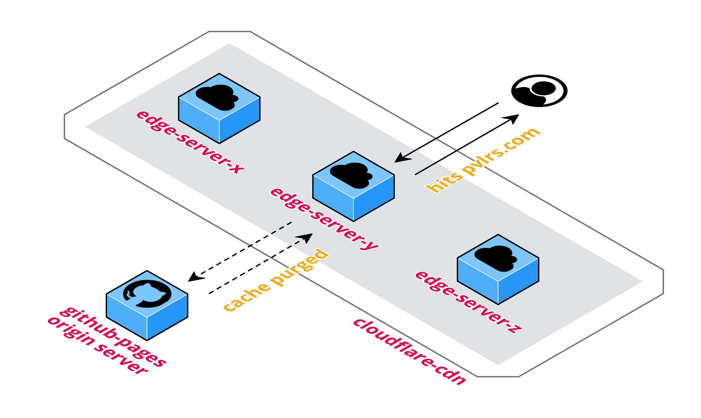

# [pvlrs.com](https://pvlrs.com)

My personal webpage

# How its assets are served

You might wonder...how come it loads so fast!? Well, there are two main reasons.

1. It's simple; just `HTML` & `CSS`. Any framework would simply be an overkill...and slow 😇
2. It's close to you! That's because the assets are actually served from [`Cloudflare`'s CDN](https://www.cloudflare.com/en-gb/cdn/). Here's what that looks like:

